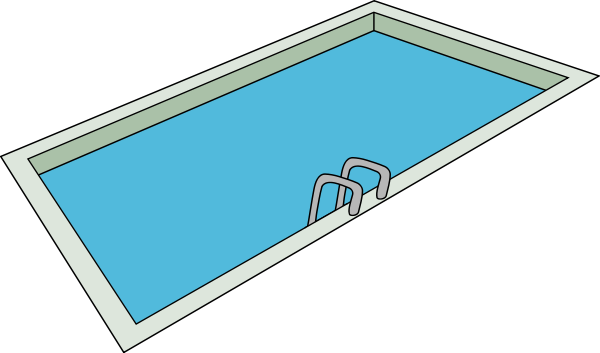

WorkerPool
==========



Config:

```

use Mix.Config

config :exsouth,
    workerpool: []


config :workerpool,
    mysql: [size: 10, host: 'localhost', database: 'workerpool', user: 'root']

config :workerpool, :pools, 
    default_pool: [
        refresh_timeout: :timer.seconds(5),
        worker_life_time: :timer.seconds(5)
    ],
    pool_1: [
        refresh_timeout: :timer.seconds(5),
        worker_life_time: :timer.seconds(5)
    ]

```

Update Worker

```
WorkerPool.update "my_worker_name"
=> :ok

WorkerPool.update "my_second_worker_name"
=> :ok


WorkerPool.update :pool_1, "my_another_worker_name"
=> :ok

```

Get Worker

```
WorkerPool.get
=> "my_worker_name"
WorkerPool.get
=> "my_second_worker_name"


WorkerPool.get :pool_1
=> "my_another_worker_name"

WorkerPool.get :pool_1
=> "my_another_worker_name"

#After timeout

WorkerPool.get :pool_1
=> nil

```